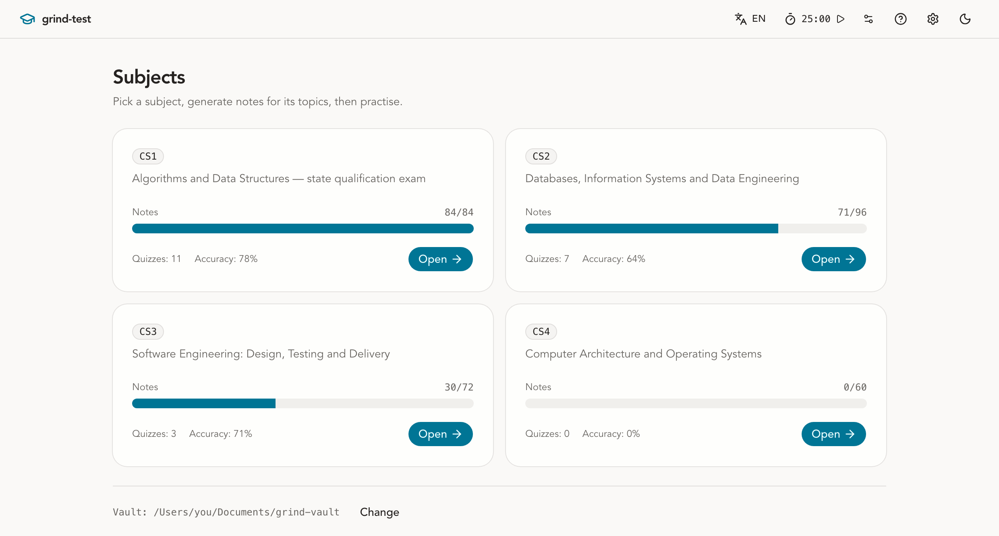
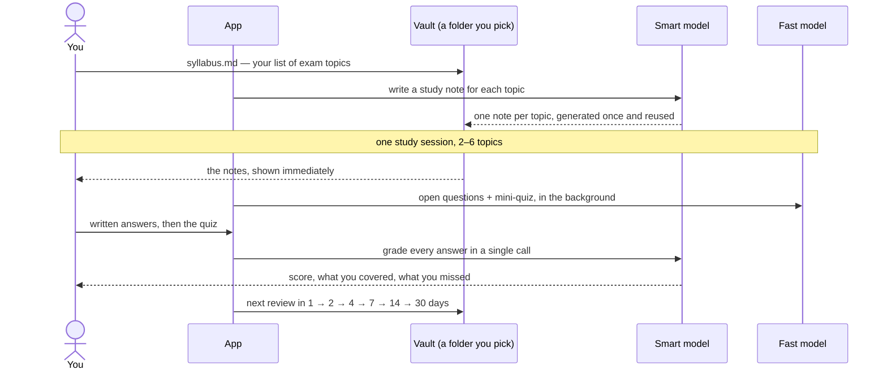

# grind-test

<p align="center">
  
</p>

<p align="center">
  A desktop app for exam prep. Give it your list of exam topics; it writes you a study note
  for each one, walks you through them, and remembers what you keep forgetting.
</p>

## How it works



## Features

- **Study notes** written once per topic and cached on disk — the gist, the topic answered
  in one paragraph, the mechanism, key terms and the traps examiners use.
- **Sessions**: read, answer one broad exam-style question per topic in writing, then a
  mini-quiz. The written half is graded against a rubric and counts for 60%.
- **Spaced repetition** — a Leitner ladder decides what you see next and when.
- **Three paces**: full note + essay answer, full note + bullet points, or a condensed note
  for a sprint. The answer is cut before the reading.
- **Exam-style topic draw** — one from each part of the syllabus, leaning toward your
  weakest, the way a ticket is drawn. Or follow the schedule, or pick by hand.
- **No waiting to start** — notes open instantly while the questions generate behind them.
- **Nothing is lost** — sessions are written to disk at once, answers drafted as you type,
  and an interrupted one is resumable.
- **Hints** during a quiz, grounded in that topic's note, never containing the answer.
- **Pomodoro timer** in the header, configurable, running across screens.
- **Pick your models** per tier — Gemini, Claude, anything `agy` lists.
- **Interface in Ukrainian, Russian or English.** Notes and questions stay Ukrainian: that
  is the language of the exam.
- **Plain files** — markdown and JSON in a folder you choose. No database, no account.
- macOS and Windows, light and dark, with a tray icon.

## Running it

```bash
bun install
bun run tauri dev
```

Needs the [Antigravity](https://antigravity.google) CLI (`agy`) on your `PATH`, or its path
in `GRIND_AGY_BIN` — it is the app's only model access. Work is split across two tiers: a
smart model for notes, grading and hints, a fast one for quizzes and session questions.
**Моделі** in the header picks which model each tier uses. Which tier a job runs at is fixed:
a study note is worth paying for, a quiz is not.

Filling the notes for 250+ topics is easier from a terminal, and it is resumable — topics
that already have a note are skipped:

```bash
cd src-tauri && cargo run -p grind -- knowledge --subject demo --concurrency 4
```

To build it: `bun run tauri build` — a `.app` on macOS, an NSIS installer on Windows.

Releases carry three downloads: an Apple Silicon `.dmg` (4 MB), a universal one for Intel
Macs (7.6 MB), and the Windows installer. Both images come from the same universal build —
the arm64 one is `lipo`-thinned out of it, so an M-series Mac is not asked to download an
Intel slice it will never run. They are assembled with `hdiutil`, because Tauri's own dmg
bundler needs Finder automation that no CI runner has.

## The vault

Everything the app knows lives in one folder you choose. On first launch it asks where:
point at an existing folder, or let it create one. Nothing on disk is read before you
answer, so macOS never raises a folder prompt for somewhere you did not name.

**The app creates the structure; you supply the topics.** Creating a vault gives you the
directories and one sample syllabus showing the format — but what to study is yours to
write. A syllabus is a markdown file: a title, sections under `##`, a numbered list of
topics under each. The filename becomes the subject id.

```
your-vault/
├── syllabus/       ← you write these: one file per subject
│   └── demo.md
├── knowledge/      ← generated notes, one per topic
├── quizzes/
└── progress/       ← attempts, mastery, review schedule
```

Everything but `syllabus/` fills itself in as you use the app.

---

Architecture and conventions: [CLAUDE.md](CLAUDE.md) · what is planned and why:
[ROADMAP.md](ROADMAP.md)
